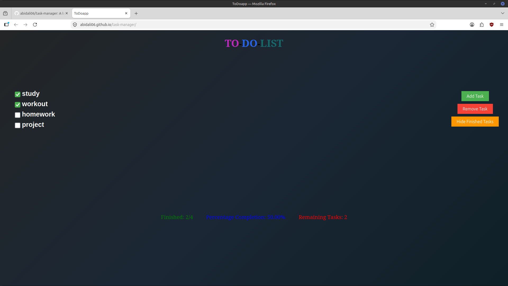
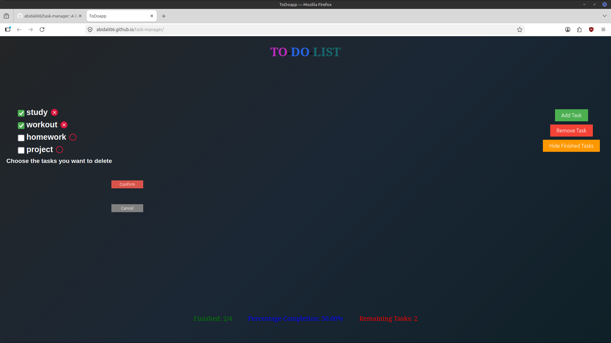
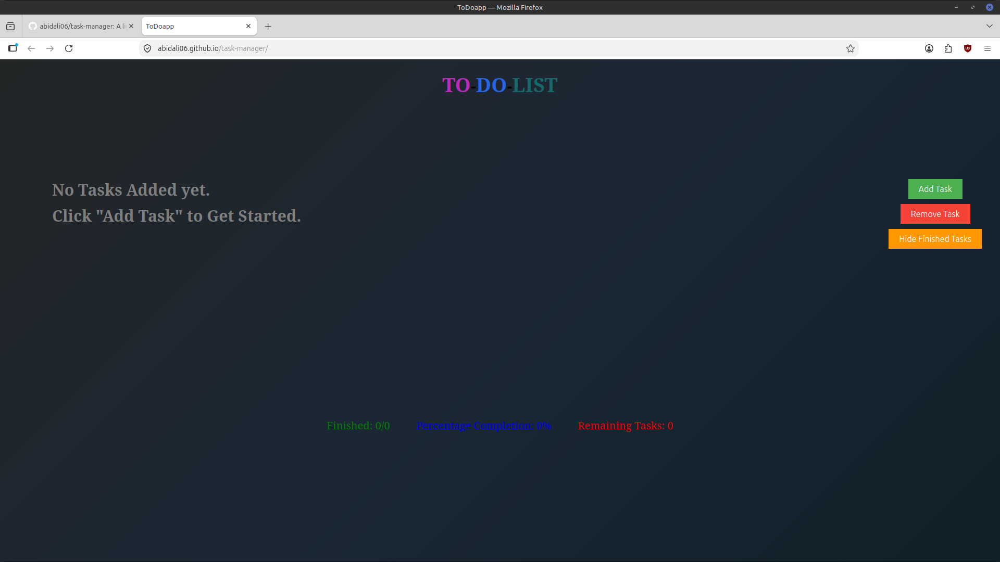

# Task Manager

A lightweight task management application built with HTML, CSS and Vanilla JavaScript.

## Live Demo

https://abidali06.github.io/task-manager/

## Features

- Add tasks
- Mark tasks as completed
- Delete multiple tasks
- Hide completed tasks
- Progress statistics
- LocalStorage persistence
- Empty and hidden states

## Screenshots

### Main Interface

### Delete Mode

### Empty State

## Technologies

- HTML
- CSS
- Vanilla JavaScript (ES6+)
- LocalStorage

## Future Improvements

- Responsive design
- Task priorities
- Notes
- Sorting and filtering
- Persistent hidden state
- Light-mode/Dark-mode toggle
